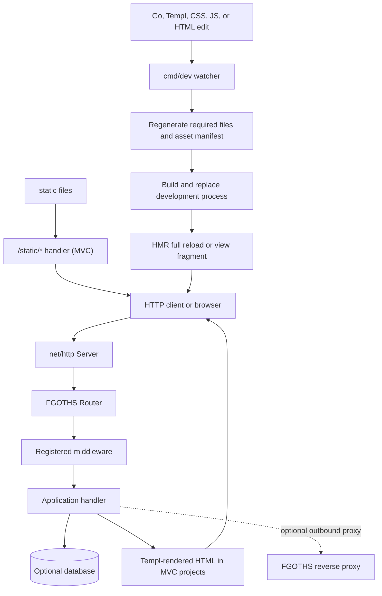

# Generated application architecture

FGOTHS generates ordinary Go modules. Each project owns its source and can be
changed independently after generation; it does not import the framework
repository as a runtime module. The project receives the runtime sources and
optional feature code needed by its selected preset and features.

See [ARCHITECTURE.md](./ARCHITECTURE.md) for runtime contracts and
[README.md](./README.md) for generator commands and supported features.

## Request and development flow



The reverse proxy is an opt-in runtime component; inbound application requests
are not automatically routed through it. The `Server` owns the FGOTHS router.
Generated routes should be registered with `server.Get`, `Post`, `Put`,
`Patch`, `Delete`, or `Handle`; replacing the embedded `server.Handler` bypasses
the router and its middleware. The standalone control-plane server is a
specialized exception and installs its own handler.

Middleware runs in registration order, from outermost to innermost. MVC
collection routes generated by `fgoths generate crud` currently provide
`GET` (list) and `POST` (create); item-by-ID read, update, and delete routes
are not generated.

## Generated project layouts

### Flat API (`--preset=api`)

```text
project/
├── main.go
├── cmd/
│   ├── assetmanifest/
│   └── dev/
├── handlers/
├── internal/
│   └── assets/             # URL helper and generated fingerprint manifest
├── pkg/runtime/            # selected runtime source files and HMR support
├── static/
└── go.mod
```

Database and feature packages are generated only when selected. The flat
preset does not generate Templ views or install an MVC static-file route by
default.

### MVC webapp (`--preset=webapp`)

```text
project/
├── main.go
├── cmd/
│   ├── assetmanifest/
│   └── dev/
├── handlers/
├── internal/
│   ├── assets/             # fingerprint URL helper and generated manifest
│   └── database/           # when a database is selected
├── middleware/
├── models/
├── pkg/runtime/
├── static/
└── views/                  # Templ source and generated Go
```

The generated MVC server registers application routes and `/static/*` on the
same `runtime.Server`. Templ layouts use `internal/assets.URL` for assets.
`cmd/assetmanifest` hashes regular files beneath `static/` into a deterministic
manifest. A matching fingerprint receives immutable production caching;
development disables browser caching and reloads the page after CSS, JS, or
HTML asset changes. Templ view changes can use the HMR fragment flow when the
watcher can map the view to the current route.

## Generation, tests, and containers

1. `fgoths init` validates the project configuration and renders the selected
   templates into a new project directory.
2. `make generate` refreshes dependencies and generated assets. MVC projects
   compile `.templ` files; flat projects have no Templ compilation step.
3. `make run` and `make build` depend on generation. `make dev` starts the
   generated watcher, which rebuilds the app when source or assets change.
4. `make docker-build` uses the generated Dockerfile and BuildKit to build a
   production image. Validate the Docker toolchain separately; Docker builds
   are not part of the repository's default Go test suite.

The framework test suite includes generator tests and generated-project
integration tests for representative configurations: several flat API feature
sets and an MVC/SQLite project with generated collection routes and asset
fingerprints. Unit tests exercise the available database and feature
configuration paths, but the generated-project compile tests are not an
exhaustive Cartesian product of every possible selection. Run
`make test`, `make cover`, and `make check-templates` as described in
[CONTRIBUTING.md](./CONTRIBUTING.md).
